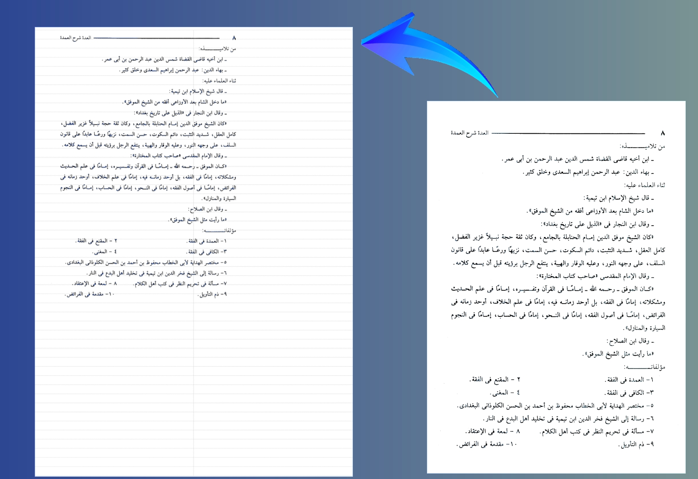

<h1 align="center">
  مخطط - Mukhattat 📚
</h1>

<h4 align="center">
  (المعروف سابقاً بـ BookToLinedMatenTool)
</h4>

  
  
  
  

  <strong>أداة متخصصة صُممت بعناية لتسهيل حياة الباحثين وطلاب العلم.</strong>

تقوم الأداة بتحويل صفحات الكتب الإلكترونية وملفات `PDF` إلى نسخ مصغرة، ودمجها بذكاء داخل قوالب مسطرة مخصصة. يتيح ذلك مساحة واسعة لكتابة التعليقات، الشروحات، والتهميش، مع مراعاة دقيقة لمسافات التجليد والطباعة الاحترافية.

  

---

## 🎯 الغاية من المشروع
يعاني العديد من الباحثين من صعوبة تفريغ التعليقات على المتون العلمية بسبب ضيق الهوامش في الكتب المطبوعة. 
جاء **مخطط** ليكون الحل التقني الأمثل لهذه المشكلة، حيث يوفر للمستخدمين إمكانية **إعادة هيكلة صفحات الكتاب** بطريقة مرنة، وتصديرها كملف PDF جاهز للطباعة والتجليد.

## ✨ الميزات الرئيسية
- 📄 **معالجة متقدمة لملفات PDF:** استيراد وقراءة الكتب الضخمة بكفاءة عالية.
- ✂️ **اقتصاص ذكي (Auto-Cropping):** خوارزمية دقيقة لاكتشاف حدود النص تلقائيًا وإزالة الهوامش البيضاء الزائدة.
- 📖 **دعم التجليد العربي:** تعديل إزاحة الهوامش ديناميكيًا لتلائم الصفحات الفردية والزوجية في نظام التجليد من اليمين إلى اليسار.
- 🖨️ **تصدير عالي الجودة:** تجميع وتصدير النتائج إلى ملف PDF واحد جاهز للطباعة باستخدام مكتبات متقدمة.
- ⚡ **كفاءة في استهلاك الموارد:** إدارة محسّنة للذاكرة تضمن استقرار الأداء حتى عند معالجة آلاف الصفحات المتتالية.
- ⚙️ **معالجة في الخلفية:** واجهة مستخدم سلسة لا تتجمد، بفضل الاعتماد على المعالجة غير المتزامنة (Asynchronous Processing).

## 💻 التقنيات المستخدمة
تم بناء هذا المشروع ليكون أداة قوية ومستقرة، بالاعتماد على:
* **C# / .NET Framework:** لتطوير واجهة المستخدم والمنطق البرمجي.
* **PdfiumViewer:** لتحليل وعرض ملفات PDF.
* **PdfSharp:** لإنشاء وبناء ملفات PDF النهائية.
* **GDI+:** للمعالجة الرسومية الدقيقة.

## ⚖️ التراخيص والاستخدام
هذا المستودع يمثل واجهة استعراضية (Showcase) للتعريف بالمشروع وقدراته. الكود المصدري الأصلي للتطبيق **خاص (Private)** ومحفوظ حقوق الملكية.

للتواصل أو الاستفسار حول إمكانيات المشروع أو التعاون، يُرجى فتح **(Issue)** في هذا المستودع أو التواصل مباشرة.

